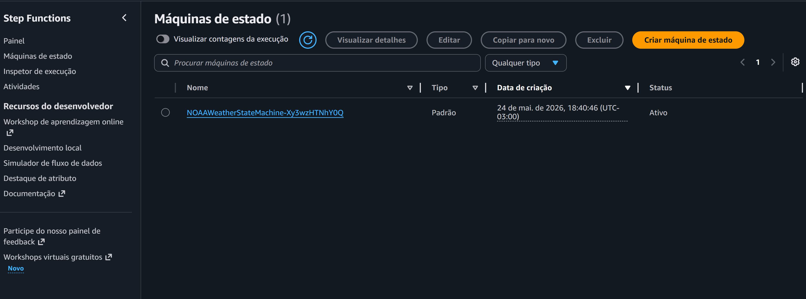
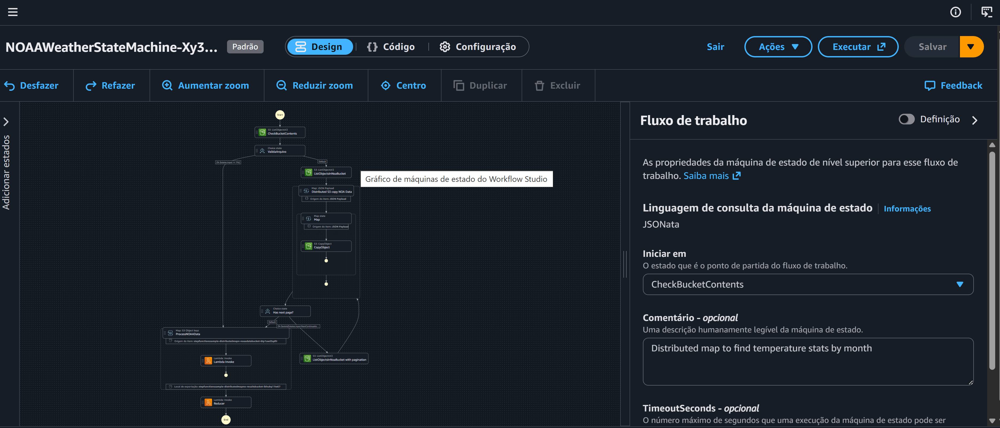
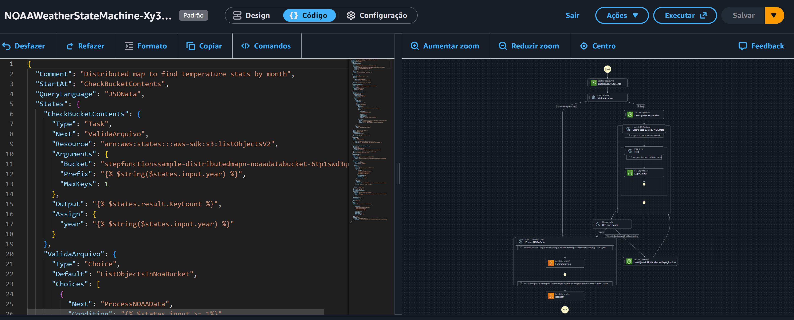
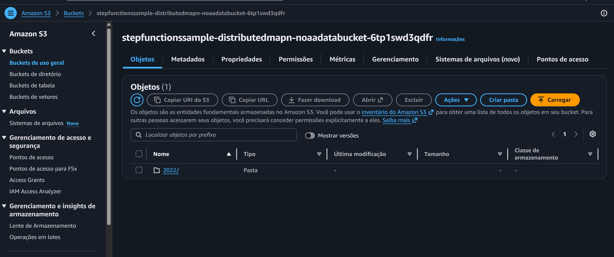
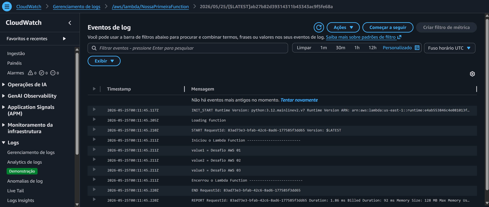

# AWS Step Functions

Este repositório documenta e reproduz o comportamento observado nas telas de uma orquestração serverless que utiliza **AWS Step Functions**, **Lambda**, **S3** e **CloudWatch Logs** para processar dados climáticos da NOAA.

## 🖼️ O que as imagens mostram (ações principais)
### 1. Painel da Step Function(imagem 01)

- Listagem de máquinas de estado, com destaque para `NOAAWeatherStateMachine-Xy3...`
- Opções de **editar**, **copiar**, **excluir** e **criar nova** máquina.
- Filtro por **Nome**, **Tipo**, **Data de criação** e **Status**.
- Execução ativa em `24 de mai. de 2026, 18:40:46 (UTC-03:00)`.

### 2. Designer da Máquina de Estado (imagem 02)

- Ferramentas de **zoom**, **centralizar**, **duplicar** e **excluir** nós.
- Propriedade `StartAt` apontando para `CheckBucketContents`.
- Comentário descritivo: *"Distributed map to find temperature stats by month"*.
- Campo `TimeoutSeconds` (opcional) definido para controlar duração máxima da execução.

### 3. Código e Fluxo Visual (imagem 03)

- **Linguagem de consulta**: `JSONData` (JSONata).
- Estado `CheckBucketContents`:
  - Tipo: `Task`
  - Recurso: `arn:aws:states::aws-sdk:s3:listObjectsV2`
  - Argumentos: `Bucket`, `Prefix` (ano dinâmico), `MaxKeys: 1`
  - Saída: ``
  - Atribuição: `year`
- Estado `ValidateArquivo`:
  - Tipo: `Choice`
  - `Default`: `ListObjectsInNoaBucket`
- Fluxograma lateral mostra:
  - Início → `CheckBucketContents` → `ValidateArquivo`
  - Em seguida: `Map JSON Payload` → `Distributed SS copy NOAA Data`
  - Mapa distribuído com origem `JSON Payload`
  - Múltiplas invocações `Lambda invoke`

### 4. Bucket S3 (imagem 04)

- Bucket: `stepfunctionsample-distributedmapn-noaadatabucket-6tp1swd3qdfr`
- **1 objeto** listado (pasta `2022/`)
- Ações disponíveis: copiar URI, fazer download, abrir, excluir, criar pasta, carregar.
- Abas: **Objetos**, **Metadados**, **Permissões**, **Métricas**, **Gerenciamento**.

### 5. CloudWatch Logs (imagem 05)

- Filtro de eventos com suporte a padrões.
- Intervalos de tempo: 1m, 30m, 1h, 12h ou personalizado.
- **Operações de IA** e **Application Signals** disponíveis.
- Logs mostram execução real de uma Lambda Python 3.12:
  - `INIT_START`, `Loading function`
  - `START RequestId: 83ad73e3-bfab-42c6-8ad6-177585f3dd65`